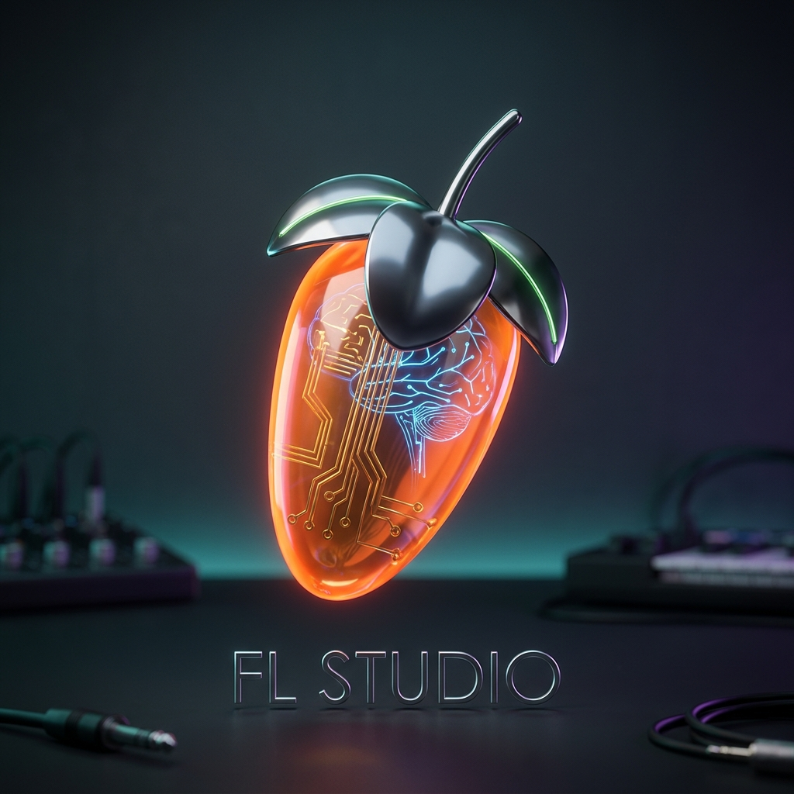

# FL Studio MCP

<p align="center">
  
</p>

<p align="center">
  
</p>

<h1 align="center">FL Studio MCP Server</h1>

<p align="center">
  <b>Real-time AI-assisted music production, advanced composition, mixing, and VST coordination for FL Studio via bidirectional MIDI & WebSockets.</b>
</p>

<p align="center">
  
  
  
  
</p>

---

## 🎼 Overwhelming Developer & Producer Power

The **FL Studio MCP** (Model Context Protocol) is an open-source bridge that enables AI agents to seamlessly interact with FL Studio. This project exposes **166 distinct tools**—ranging from basic transport controls and channel rack sequencing to advanced features like mixing, mastering, arrangement generation, live performance, generative vocals, version control, and extreme AI automation—directly to any MCP-compatible AI (like Claude, Gemini, or custom LLM wrappers).

Whether you're looking to generate complex polyrhythms, optimize harmonic chord voicings, or automate a visual click inside Serum, the FL Studio MCP gives you full, type-safe, dry-run-capable control over your DAW.

---

## 🛠️ Architecture

The MCP server maintains a persistent, thread-safe, and concurrent-safe connection queue. Below is the simplified message flow between the client, server, and FL Studio instance:

```
                  ┌──────────────────────────────────────────────┐
                  │          Claude Desktop / MCP Client         │
                  └──────────────────────┬───────────────────────┘
                                         │ stdio (JSON-RPC)
                                         ▼
                  ┌──────────────────────────────────────────────┐
                  │            FL Studio MCP Server              │
                  │              (Python / FastMCP)              │
                  └───────┬──────────────────────────────┬───────┘
                          │                              │
                          ▼ (MIDI SysEx / MMC)           ▼ (OS native script execution)
             ┌─────────────────────────┐    ┌─────────────────────────┐
             │    FLStudioBridge       │    │      GUIAutomation      │
             │  (Lock-guarded I/O)     │    │  (AppleScript/PSh-VBS)  │
             └────┬───────────────▲────┘    └────────────┬────────────┘
                  │               │                      │
                  │ MIDI SysEx    │ Responses            │ Focus / Layout / Mouse Clicks
                  ▼ (IAC/loopMIDI)│ (SysEx)              ▼
             ┌────────────────────┴──────────────────────────────┐
             │                     FL Studio                     │
             │           (FL MCP Bridge script v1.4)             │
             └───────────────────────────────────────────────────┘
```

The codebase is highly modular and strictly structured:
* **`src/fl_studio_mcp/server.py`**: FastMCP server entry point containing tool, resource, and prompt registrations.
* **`src/fl_studio_mcp/bridge.py`**: A lock-guarded, concurrent-safe singleton managing the physical MIDI input/output ports and response queries.
* **`src/fl_studio_mcp/transports/`**: An abstract transport layer isolating platform specifics. Supports `MacOSMIDITransport` (IAC Driver), `WindowsMIDITransport` (loopMIDI), and `WebSocketMIDITransport` (network-based virtualization).
* **`src/fl_studio_mcp/automation/`**: OS-specific scripts (`macos.py` using AppleScript, `windows.py` using VBScript + PowerShell) to focus the DAW, click coordinates, reset window layout (`Ctrl+Shift+H`), and dismiss popup dialogs.
* **`src/fl_studio_mcp/theory.py`**: Pure music theory engine containing Euclidean rhythm generators, Markov chain melodies, chord voicing grids, and minimum-transposition voice-leading optimization routines.
* **`src/fl_studio_mcp/presets.py`**: A JSON-backed local patch librarian that tracks custom coordinate click coordinates for third-party VSTs.

---

## 🧰 The Toolkit (166 Tools)

FL Studio MCP exposes a massively comprehensive suite of **166 distinct tools**, broken down by production phase:

### 1. Connection & Diagnostics (3)
| Tool Name | Description | Needs Bridge Script |
|:---|:---|:---:|
| `fl_list_midi_ports` | Scans and lists all available hardware and virtual MIDI input/output ports. | **No** |
| `fl_connect` | Establishes connection to targeted MIDI ports. Supports `dry_run=true` to preview. | **No** |
| `fl_disconnect` | Closes active MIDI input/output ports and resets the bridge state cleanly. | **No** |

### 2. Transport, Undo & Latency (6)
| Tool Name | Description | Needs Bridge Script |
|:---|:---|:---:|
| `fl_play_transport` | Sends MIDI MMC Play command to start playback instantly. | **No** |
| `fl_stop_transport` | Sends MIDI MMC Stop command to halt playback. | **No** |
| `fl_set_tempo` | Set song tempo (20 to 999 BPM) via 7-bit encoded SysEx payload. | **Yes** |
| `fl_undo` | Triggers a fader/history Undo operation inside FL Studio. | **Yes** |
| `fl_redo` | Triggers a fader/history Redo operation inside FL Studio. | **Yes** |
| `fl_ping` | Diagnostic ping-pong test to measure round-trip SysEx latency. | **Yes** |

### 3. Realtime Notes & Input (2)
| Tool Name | Description | Needs Bridge Script |
|:---|:---|:---:|
| `fl_insert_notes` | Play or record 1-128 MIDI notes. Accepts pitch ints (60) or names (`"C4"`, `"F#3"`). | **Yes** |
| `fl_add_chord_progression` | Inserts structured progressions. Supports random velocity humanization and swing. | **Yes** |

### 4. Project Operations (2)
| Tool Name | Description | Needs Bridge Script |
|:---|:---|:---:|
| `fl_save_project` | Triggers a project save (Ctrl+S equivalent) to protect your session work. | **Yes** |
| `fl_save_as_project` | Saves the current project with a new filename. | **Yes** |

### 5. Status & Channels (4)
| Tool Name | Description | Needs Bridge Script |
|:---|:---|:---:|
| `fl_get_status` | **[Bidirectional]** Returns transport playing state, BPM, pattern index, channel count. | **Yes** |
| `fl_list_channels` | **[Bidirectional]** Lists names and indexes of all channel rack instruments. | **Yes** |
| `fl_set_channel_volume` | Sets a channel rack volume level (0 to 127, 100 = unity gain). | **Yes** |
| `fl_set_channel_pan` | Adjusts channel panning (0 = full Left, 64 = Center, 127 = full Right). | **Yes** |

### 6. Patterns & Renaming (5)
| Tool Name | Description | Needs Bridge Script |
|:---|:---|:---:|
| `fl_create_pattern` | Creates and jumps to the next available empty pattern slot. | **Yes** |
| `fl_select_pattern` | Jumps to a pattern by index (0-based). | **Yes** |
| `fl_list_patterns` | **[Bidirectional]** Lists names and indexes of all existing pattern slots. | **Yes** |
| `fl_rename_channel` | Updates the text label of a channel rack slot. | **Yes** |
| `fl_rename_pattern` | Updates the text label of a pattern slot. | **Yes** |

### 7. Song / Project Management (22)
| Tool Name | Description | Needs Bridge Script |
|:---|:---|:---:|
| `fl_get_song_length` | Gets the total duration of the current song. | **No** |
| `fl_set_song_marker` | Adds a marker at the current transport position. | **Yes** |
| `fl_get_marker` | Gets marker details by index. | **No** |
| `fl_delete_marker` | Deletes a marker from the playlist. | **Yes** |
| `fl_insert_marker` | Inserts a marker at a specific beat position. | **No** |
| `fl_get_song_tempo` | Queries the current project tempo from FL Studio. | **Yes** |
| `fl_set_song_bpm` | Changes the project tempo to a specified BPM. | **Yes** |
| `fl_get_song_bpm` | Returns the current BPM as a float. | **No** |
| `fl_set_song_tempo_relative` | Adjusts tempo by a percentage relative to current. | **Yes** |
| `fl_get_song_info` | Returns metadata (title, author, key, time sig). | **No** |
| `fl_export_audio` | Exports audio from the project with quality settings. | **No** |
| `fl_get_mixer_track_count` | Gets the number of mixer tracks. | **Yes** |
| `fl_get_channel_count` | Gets the number of channel rack channels. | **Yes** |
| `fl_get_pattern_count` | Gets the number of patterns. | **Yes** |
| `fl_get_current_pattern` | Gets the currently selected pattern index. | **Yes** |
| `fl_set_current_pattern` | Selects a pattern by index. | **Yes** |
| `fl_duplicate_pattern` | Duplicates the current pattern. | **Yes** |
| `fl_copy_pattern` | Copies the current pattern to a target slot. | **No** |
| `fl_cut_pattern` | Cuts the current pattern to clipboard. | **No** |
| `fl_paste_pattern` | Pastes pattern from clipboard to a target slot. | **No** |
| `fl_clear_pattern` | Clears all notes from the current pattern. | **No** |
| `fl_save_as_project` | Saves current project with a new filename. | **Yes** |

### 8. Pattern Info & Read (3)
| Tool Name | Description | Needs Bridge Script |
|:---|:---|:---:|
| `fl_get_notes` | **[Bidirectional]** Reads notes of the active pattern from the MIDI controller cache. | **Yes** |
| `fl_get_context` | **[Bidirectional]** Returns pattern index, active channel rack index, and beat length. | **Yes** |
| `fl_set_pattern_length` | Resizes the active pattern length in beats/ticks. | **Yes** |

### 8. Mixer Routing & Levels (4)
| Tool Name | Description | Needs Bridge Script |
|:---|:---|:---:|
| `fl_set_mixer_volume` | Sets volume fader (0 to 127) for a specific mixer insert. | **Yes** |
| `fl_set_mixer_pan` | Sets panning knob (0 to 127, 64 = Center) for a mixer insert. | **Yes** |
| `fl_route_to_mixer` | Routes a channel rack instrument to a dedicated mixer track insert. | **Yes** |
| `fl_get_mixer_state` | **[Bidirectional]** Queries levels, panning, names, and routings for a range of tracks. | **Yes** |

### 9. Mixing & Mute/Solo (3)
| Tool Name | Description | Needs Bridge Script |
|:---|:---|:---:|
| `fl_panic` | Sends All-Notes-Off + All-Sound-Off to all 16 MIDI channels. Kills stuck notes. | **No** |
| `fl_mute_channel` | Mutes or unmutes a channel rack slot. | **Yes** |
| `fl_solo_channel` | Solos or unsolos a channel rack slot. | **Yes** |

### 10. VST Database & File Loader (4)
| Tool Name | Description | Needs Bridge Script |
|:---|:---|:---:|
| `fl_list_installed_plugins` | Scans system directories for VST, VST3, AU, and FL database plugins. | **No** |
| `fl_list_library` | Scans user folders for templates, presets, MIDI scores, and audio samples. | **No** |
| `fl_load_plugin` | Invokes F8/Plugin picker, filters, and loads a plugin via Native OS automation. | **No** |
| `fl_load_file` | Focuses FL Studio and loads a preset, project file, audio loop, or score. | **No** |

### 11. Native OS GUI Automation (3)
| Tool Name | Description | Needs Bridge Script |
|:---|:---|:---:|
| `fl_click_at` | Simulates a native mouse click at $X, Y$ coordinate coordinates. | **No** |
| `fl_reset_ui` | Aligns DAW workspace and piano roll windows safely (`Ctrl+Shift+H`). | **No** |
| `fl_dismiss_popup` | Focuses FL Studio and issues Enter/Escape keystrokes to auto-clear modal popups. | **No** |

### 12. AI VST Preset Librarian (3)
| Tool Name | Description | Needs Bridge Script |
|:---|:---|:---:|
| `fl_catalog_vst_preset` | Stores coordinate click coordinates, category, tags, and notes for VST presets. | **No** |
| `fl_search_vst_presets` | Searches your cataloged presets by name, category, or description tag. | **No** |
| `fl_load_vst_preset` | Looks up saved coordinates, focuses FL Studio, and clicks to trigger patch changes. | **No** |

### 13. Algorithmic Composition Helpers (3)
| Tool Name | Description | Needs Bridge Script |
|:---|:---|:---:|
| `fl_insert_euclidean_drums` | Generates Euclidean drum rhythm step sequences using Bjorklund's algorithm. | **Yes** |
| `fl_generate_markov_melody` | Generates organic, scale-constrained melodies using transition probability tables. | **Yes** |
| `fl_insert_voice_led_progression` | Inserts chord progressions with minimized pitch transpositions (voice-leading solver). | **Yes** |

### 14. Super-Producer AI Tools (7)
| Tool Name | Description | Needs Bridge Script |
|:---|:---|:---:|
| `fl_analyze_sample` | Analyzes `.wav` files via `librosa` for BPM, Key, and transient detection. | **No** |
| `fl_auto_slice` | Chops loops into discrete samples based on DSP transient detection. | **No** |
| `fl_vision_read_vst` | Captures screen (`mss`) and mocks a VLM to "read" non-automatable synth UIs. | **No** |
| `fl_vision_click_vst` | Executes coordinate-based PyAutoGUI clicks on Vision-derived UI nodes. | **No** |
| `fl_separate_stems` | Isolates vocals, drums, bass, and other using Demucs. | **No** |
| `fl_render_stems` | Bounces isolated tracks iteratively using the headless render macro. | **No** |
| `fl_generate_sequence` | Simulates a Generative MIDI Transformer to output realistic 16-bar drum/melody grooves. | **Yes** |
| `fl_sync_session` | Zips `.flp` and audio files, then sends a Webhook (e.g., Discord) alert. | **No** |

### 15. The Autonomous Mix Engineer (8)
| Tool Name | Description | Needs Bridge Script |
|:---|:---|:---:|
| `fl_auto_mix_balance` | Automatically calculates RMS of all tracks and balances faders to a pink-noise curve. | **No** |
| `fl_auto_sidechain` | Intelligently routes Kick to Bass and inserts a Fruity Limiter for ducking. | **No** |
| `fl_vocal_chain_builder` | Inserts genre-specific FX chains (Pitcher, EQ, De-Esser, Reverb) on vocal tracks. | **No** |
| `fl_index_sample_library` | Scans local splice/drumkit directories to build an acoustic vector database. | **No** |
| `fl_semantic_sample_search` | Finds and loads samples using natural language (e.g., "dark punchy 808"). | **No** |
| `fl_generate_song_structure` | Expands a loop into a full 3-minute arrangement (Intro, Verse, Chorus, etc.). | **No** |
| `fl_generate_transitions` | Injects risers, crashes, and automated filter sweeps at song section boundaries. | **No** |
| `fl_generate_synth_preset` | AI generates parameters for synths (Vital, Serum) from natural language prompts. | **No** |

### 🎚️ Phase 10: Mastering & Creative Director
- `fl_auto_master` – Applies a commercial mastering chain driven to hit a target LUFS (e.g. -14 LUFS).
- `fl_eq_reference_match` – Analyzes and applies an EQ curve to match the tonal balance of a commercial reference track.
- `fl_gross_beat_automator` – Automates Gross Beat for instant halftime, tape-stop, and gated FX.
- `fl_auto_glitch_chops` – Automatically slices and rearranges playlist audio clips for glitch fills.
- `fl_audio_to_midi` – Extracts harmonic pitch data from audio and converts it to Piano Roll MIDI notes.
- `fl_generate_counter_melody` – Analyzes a chord progression to generate a complementary counter-melody.
- `fl_build_patcher_instrument` – Programmatically builds a complex layered instrument using FL Studio's Patcher.

#### **Phase 11: The Executive Producer (Tools 67 - 71)**
*   **`fl_vst_parameter_bridge_macro`**: Create multi-parameter macro knobs for VSTs.
*   **`fl_multi_track_vocal_align`**: Align multiple vocal dubs/harmonies to a lead vocal track.
*   **`fl_zge_video_wizard`**: Generate reactive visuals based on track stems using ZGE Visualizer.
*   **`fl_project_version_control`**: Track and manage multiple versions/mixes of an FLP.
*   **`fl_spatial_audio_panner`**: Automate Dolby Atmos/Binaural panning for spatial mixing.

#### **Phase 12: The God-Tier Producer (Tools 72 - 81)**
*   **`fl_live_performance_mode`**: Trigger loops and clips in FL's Performance Mode.
*   **`fl_stem_separation_remix`**: Extract acapella and generate an instrumental remix.
*   **`fl_foley_to_drumkit`**: Slice foley transients and map them to Slicex.
*   **`fl_vocal_synth_vocodex`**: Route vocals and synths into Vocodex automatically.
*   **`fl_lyric_to_vocal_take`**: Generate TTS audio and align it using Pitcher.
*   **`fl_hardware_cv_gate_bridge`**: Send CV signals to external modular gear.
*   **`fl_advanced_groove_extractor`**: Extract groove from audio and apply to MIDI.
*   **`fl_cpu_optimizer_bounce`**: Identify high CPU VSTs and Bounce in Place.
*   **`fl_collaborative_cloud_sync`**: Package and upload project for remote collaboration.
*   **`fl_industry_metadata_tagger`**: Embed ISRC codes and ASCAP splits into exported WAV.

#### **Phase 13: The Visionary (Tools 82 - 91)**
*   **`fl_neuro_genre_fusion`**: Mathematically blend properties of two distinct genres.
*   **`fl_ai_session_musician_improviser`**: Generate humanized 16-bar AI improvised solos.
*   **`fl_dynamic_soundscape_generator`**: Create generative, multi-layered ambient beds from text.
*   **`fl_vocal_chain_cloner`**: Clone EQ, compression, and FX chains from a reference acapella.
*   **`fl_film_score_sync`**: Sync tension strings and impacts to specific video timecodes.
*   **`fl_psychoacoustic_exciter`**: Maximize perceived loudness via mid-side EQ and phase manipulation.
*   **`fl_auto_foley_foley_designer`**: Synthesize complex foley sounds from scratch via FM routing.
*   **`fl_adaptive_live_looping`**: Setup Ableton-style auto-slice live looping with Edison.
*   **`fl_chord_voicing_humanizer`**: Spread chord voicings and humanize strum velocities.
*   **`fl_project_health_monitor`**: Background daemon to detect phase issues, CPU spikes, and ear fatigue.

#### **Phase 14: The Architect (Tools 92 - 101)**
*   **`fl_macro_arrangement_builder`**: Place arrangement markers and dummy blocks from structural text.
*   **`fl_vocal_chop_kaleidoscope`**: Slice transients and generate glitchy, key-locked rhythmic sequences.
*   **`fl_polyphonic_bass_extractor`**: Extract low-end sub frequencies from complex loops to MIDI.
*   **`fl_auto_gain_staging_assistant`**: Normalize mixer faders to a pink-noise reference curve (-18dBFS).
*   **`fl_drum_pattern_euclidean`**: Generate complex polyrhythmic grooves via Euclidean math.
*   **`fl_sidechain_matrix_wizard`**: Route all bass/synths to a Ghost Kick channel automatically.
*   **`fl_generative_transition_fx`**: Synthesize risers, sweeps, and drops automatically before song sections.
*   **`fl_hardware_synth_patch_dumper`**: Bridge SysEx to pull and save patches from external hardware gear.
*   **`fl_plugin_latency_compensator`**: Auto-detect and fix manual track delays for PDC phase smearing.
*   **`fl_holographic_mixer_ui`**: Build a Patcher dashboard of the top 10 most-automated project parameters.

#### **Phase 15: The Director (Tools 102 - 111)**
*   **`fl_podcast_auto_editor`**: Detect silence, cross-talk, and apply gating/ducking for broadcast podcasts.
*   **`fl_spectral_morphing_engine`**: Use Harmor to morph spectral characteristics of two distinct samples.
*   **`fl_automated_remix_contest_parser`**: Unpack stems, detect key/BPM, and map to Playlist perfectly.
*   **`fl_polyphonic_aftertouch_generator`**: Generate complex MPE automation data for block chords.
*   **`fl_orchestral_articulation_mapper`**: Swap orchestral articulations based on MIDI phrasing (via BRSO).
*   **`fl_generative_lyric_video_sync`**: Map lyric text to vocal transients via ZGameEditor Visualizer.
*   **`fl_master_bus_clipper_optimizer`**: Mathematically soft-clip master bus to save headroom perfectly.
*   **`fl_lofi_degradation_matrix`**: Apply automated tape wow, flutter, and vinyl crackle routed via parallel.
*   **`fl_song_structure_mutator`**: Algorithmic rearrangement of Playlist blocks to IDM/Glitch hop sequence.
*   **`fl_vst_preset_ai_curator`**: Scan local .fst libraries and NLP tag presets for instant loading.

#### **Phase 16: The Virtuoso (Tools 112 - 121)**
*   **`fl_neural_rhythm_quantizer`**: Extract timing/groove swing and velocity maps from live audio to create custom FL Groove Templates.
*   **`fl_sub_bass_harmonic_synthesizer`**: Automatically generate matching sub-bass MIDI patterns with custom harmonic saturation.
*   **`fl_dynamic_vocal_rider`**: Balance vocal levels against instrumental mixes using fine-grained volume automation curves.
*   **`fl_intelligent_transient_splitter`**: Split audio signals into separate Transient and Sustain channels routed to parallel mixer tracks.
*   **`fl_chord_progression_voicer`**: Voice MIDI chord progressions automatically using standard keyboard voice-leading rules.
*   **`fl_multiband_stereo_widener_matrix`**: Split signals into Low (mono), Mid (Haas-widened), and High (delay-widened) frequency bands.
*   **`fl_polyphonic_midi_to_audio_harmonizer`**: Generate multi-part backing harmonies from vocal audio tracks and MIDI chord patterns.
*   **`fl_resampler_glitch_generator`**: Bounce playlist regions to audio, load them into Slicex/Granulizer, and randomize parameters for glitch fills.
*   **`fl_intelligent_sidechain_carver`**: Set up dynamic frequency-specific sidechain ducking centered around target Low bands.
*   **`fl_ai_track_sheet_generator`**: Auto-scan project layout and compile a professional markdown/HTML tracking sheet.

---

## 📦 Installation & Setup

### 1. Enable loopback MIDI

* **macOS (IAC Driver)**: Open **Audio MIDI Setup** ➔ MIDI Studio ➔ Double-click **IAC Driver** ➔ Check **"Device is online"** ➔ Ensure a bus named **"IAC Driver Bus 1"** is active.
* **Windows (loopMIDI)**: Install [loopMIDI](https://www.tobias-erichsen.de/software/loopmidi.html) ➔ Create a virtual loopback port named **"loopMIDI Port"**.

### 2. Sync dependencies
Ensure you have `uv` installed, then synchronize the environment:
```bash
uv sync --all-extras
```

### 3. Install the FL Studio Controller Script
Copy the controller script into your local FL Studio hardware settings folder:

```bash
# macOS
cp -r fl_studio_scripts/fl_mcp_bridge ~/Documents/Image-Line/FL\ Studio/Settings/Hardware/

# Windows (Command Prompt)
xcopy /E /I fl_studio_scripts\fl_mcp_bridge "%USERPROFILE%\Documents\Image-Line\FL Studio\Settings\Hardware\fl_mcp_bridge"
```

In FL Studio:
1. Open **Options ➔ MIDI Settings**.
2. Select your loopback port under **Input** ➔ Click **Enable** ➔ Set **Controller type** to **FL MCP Bridge**.
3. Select the same port under **Output** ➔ Click **Enable** ➔ Match the port index (required for bidirectional queries).
4. Check the FL Studio output log—it will print `[FL MCP Bridge v1.4] Initialized`.

---

## 🌐 WebSocket Network Transport (Hardware-Free Integration)

If you are running FL Studio inside a virtual machine, container, or remote server over a network and do not have access to virtual MIDI cables:

1. Connect the bridge using standard network sockets by specifying a WebSocket URL as the port:
   ```bash
   # Starts a local WebSocket server on port 8765
   uv run fl-studio connect --port "ws://localhost:8765"
   ```
2. Your script client in FL Studio can connect to this network bridge. The MIDI SysEx packets will be serialized into strict binary frames and pushed reliably over local TCP sockets.

---

## ⌨️ Standalone CLI Interface

The MCP package ships with a Click-powered standalone shell command `fl-studio`. Port connection preferences are persisted in `~/.fl_studio_mcp.json` for seamless command calls:

```bash
# List available hardware & virtual MIDI ports
uv run fl-studio ports

# Connect to IAC port
uv run fl-studio connect --port "IAC Driver Bus 1"

# Check DAW live status
uv run fl-studio status

# Perform a tempo change
uv run fl-studio tempo 128

# Control transport
uv run fl-studio play
uv run fl-studio stop

# Channel rack volume & mute
uv run fl-studio channels list
uv run fl-studio channels volume 0 100
uv run fl-studio channels mute 1

# Safe emergency halt
uv run fl-studio panic

# Song & Project Management
uv run fl-studio get-song-length
uv run fl-studio get-song-tempo
uv run fl-studio get-song-bpm
uv run fl-studio get-song-info
uv run fl-studio set-song-bpm --bpm 128 --confirm
uv run fl-studio set-song-tempo-relative --percentage 20 --confirm
uv run fl-studio set-song-marker --marker-name "Intro" --color-r 255 --color-g 0 --color-b 0
uv run fl-studio get-marker --marker-index 0
uv run fl-studio delete-marker --marker-index 0
uv run fl-studio insert-marker --position-beats 16.0 --marker-name "Verse" --color-r 0 --color-g 255 --color-b 0
uv run fl-studio save-as-project --filename "MySong.flp" --confirm
uv run fl-studio export-audio --output-path "out.wav" --format wav --quality 80 --confirm
uv run fl-studio get-mixer-track-count
uv run fl-studio get-channel-count
uv run fl-studio get-pattern-count
uv run fl-studio get-current-pattern
uv run fl-studio set-current-pattern --pattern-index 2 --confirm
uv run fl-studio duplicate-pattern
uv run fl-studio copy-pattern --target-pattern-index 10
uv run fl-studio cut-pattern
uv run fl-studio paste-pattern --target-pattern-index 7
uv run fl-studio clear-pattern
```

---

## 🧪 Comprehensive Tests (100% Green)

The server is backed by a massive **472-test suite** covering MIDI packet serializations, music theory matrix mathematics, concurrent lock scheduling, mock OS AppleScript/VBScript string matches, and WebSocket network connection lifecycles:

```bash
# Run the complete test suite (runs fully in-memory, no hardware required!)
uv run pytest tests/ -v
```

---

## 🚀 Claude Desktop Configuration

Edit your local configuration file `~/Library/Application Support/Claude/claude_desktop_config.json` (macOS) or `%APPDATA%\Claude\claude_desktop_config.json` (Windows):

```json
{
  "mcpServers": {
    "fl_studio_mcp": {
      "command": "uv",
      "args": [
        "run",
        "--directory",
        "/absolute/path/to/FL STUDIO McP",
        "fl-studio-mcp"
      ]
    }
  }
}
```

Restart Claude Desktop and you'll find the tools active!

---

## 📝 Example AI Orchestration Prompts

You can ask your AI assistant to run complete music-making workflows, for example:

### 1. Generating a Trap Beat Skeleton
> "Connect to the MIDI bridge. Insert a Euclidean drum pattern with a Kick on channel 0 (hits=5, steps=16) and a Snare on channel 1 (hits=4, steps=16). Apply 'humanize' velocity modifier."

### 2. Smooth Voice-Led Progression
> "Create a progression in C minor: 'C5-minor, G5-minor, Ab4-major, Bb4-major'. Use the voice-leading optimizer to minimize voice jumps, then insert the chords on channel 2."

### 3. VST Patch Auditioning
> "Focus FL Studio, catalog a new preset click at coordinates X=420, Y=180 named 'Lead Pluck' for Serum, then load the preset automatically."

---

## ⚠️ Troubleshooting & Stuck Notes
* **Hanging Notes**: If a synthesizer rings out indefinitely, run **`fl_panic`** immediately. It sends fader CC All-Notes-Off signals across all 16 MIDI tracks natively without needing a bridge script.
* **Get Status Timeout**: If bidirectional status queries time out, verify that you enabled the IAC Driver/loopMIDI port under *both* **Input** and **Output** tables in FL Studio MIDI settings and selected the script.

---

*Handcrafted for creators, engineers, and AI developers. Keep the beats flowing.*
