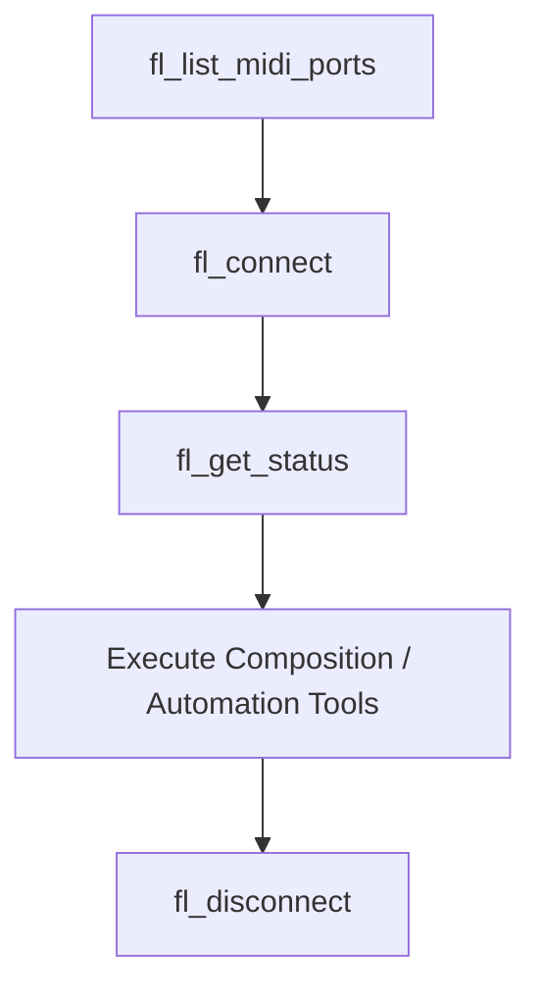

# FL Studio MCP Skill

This skill guides AI agents on how to dynamically control FL Studio, generate complex algorithmic compositions, manage VST presets via coordinate clicks, and route channels cleanly using the **FL Studio MCP Server**.

---

## 🛠️ Core Tool Workflow

Always follow this precise sequence to establish a healthy connection session:



1. **Scan Ports**: Run `fl_list_midi_ports` to find available hardware and virtual MIDI devices.
2. **Connect**: Run `fl_connect` with the target loopback port (e.g. `"FL Studio Bus"` or `"loopMIDI Port"`). 
   * *Tip*: Pass `dry_run=true` during development to preview MIDI SysEx bytes without physical output.
3. **Verify Connection**: Call `fl_get_status` to ensure FL Studio's controller script is active and responding.
4. **Disconnect**: Always call `fl_disconnect` at the end of a session to free up system MIDI ports.

---

## 🎼 Algorithmic Composition Strategies

Use these tools to inject musical structures directly into the active piano roll pattern:

### 1. Euclidean Drums (`fl_insert_euclidean_drums`)
Distributes $k$ beats across $n$ steps as evenly as possible using Bjorklund's algorithm.
* **Use Case**: Rhythmic skeletons, high-hat grooves, and polyrhythms.
* **Mapping Syntax**: Pass a JSON string mapping channel index to note/rhythm parameters.
  * *Simple*: `'{"0": "C3", "1": 38}'`
  * *Advanced*: `'{"0": {"pitch": "C3", "hits": 5, "steps": 16, "rotation": 1}}'`

### 2. Markov Chain Melodies (`fl_generate_markov_melody`)
Generates organic, scale-constrained single-voice melodic lines utilizing transition matrices.
* **Constraint**: Note choices are strictly locked to the scale signature to prevent sour notes.
* **Velocity Curve**: Pass `"crescendo"`, `"decrescendo"`, or `"humanize"` to add expressiveness.

### 3. Voice-Leading Chords (`fl_insert_voice_led_progression`)
Parses string-based chord progressions and transposes notes to minimize overall voice jumps.
* **Syntax**: E.g. `"C5-major, G5-major, A4-minor, F4-major"`
* **Algorithm**: Performs optimal octave shifting so standard chord changes feel natural, smooth, and professional.

---

## 🎛️ Channel Routing & Mixing

* **Route Instrument to Mixer**: Call `fl_route_to_mixer(channel_index, track_index)` to route a rack instrument to a dedicated mixer insert.
* **Set Levels**: Adjust panning (`fl_set_mixer_pan`) or volume (`fl_set_mixer_volume`). 
  * *Formula*: A fader volume of `100` maps exactly to FL Studio's `0.787` unity gain.

---

## 🖱️ Deep VST & GUI Automation

When controlling third-party plugins (e.g., Serum, Vital) that do not expose MIDI preset changes:

1. **Catalog Preset**: Call `fl_catalog_vst_preset` saving the exact $X, Y$ coordinate coordinates of the plugin's patch forward button.
2. **Load Preset**: Call `fl_load_vst_preset` to automatically focus FL Studio and trigger a simulated mouse click on the coordinates.
3. **Rearrange Workspace**: Use `fl_reset_ui` to realign overlapping tool windows (`Ctrl+Shift+H`).

---

## ⚠️ Troubleshooting & Stick Note Recovery

* **Stuck Notes?** If a synthesizer hangs or rings indefinitely, immediately run **`fl_panic`** to broadcast a full MIDI All-Notes-Off signal across all tracks.
* **Write Acknowledgements**: If sending fast, successive notes, enable `RESP_ACK` in parameters to ensure FL Studio processes each note before sending the next.

---

## 🎵 Song/Project Management Tools

These 22 tools handle song-level operations — markers, tempo, save-as, export, and queries for mixer/channel/pattern counts.

### Markers (6 tools)
| Tool | Description |
|------|-------------|
| `fl_set_song_marker` | Add a marker at the current transport position with name and RGB color |
| `fl_get_marker` | Query marker details by index |
| `fl_delete_marker` | Remove a marker by index |
| `fl_insert_marker` | Insert a marker at a specific beat position with name and color |
| `fl_get_song_length` | Get total song duration in seconds |
| `fl_get_song_info` | Get comprehensive song metadata (title, author, BPM, key, time signature, markers, etc.) |

### Tempo (3 tools)
| Tool | Description |
|------|-------------|
| `fl_get_song_tempo` | Query current BPM as integer (via bidirectional status) |
| `fl_get_song_bpm` | Query current BPM as float (higher precision) |
| `fl_set_song_bpm` | Set absolute BPM (20-999) — requires `confirm=true` |
| `fl_set_song_tempo_relative` | Adjust tempo by percentage (-50% to +200%) — requires `confirm=true` |

### Project Management (2 tools)
| Tool | Description |
|------|-------------|
| `fl_save_as_project` | Save project with a new filename (.flp) — requires `confirm=true` |
| `fl_export_audio` | Export audio (wav/mp3/flac) with quality 0-100 — requires `confirm=true` |

### Count Queries (3 tools)
| Tool | Description |
|------|-------------|
| `fl_get_mixer_track_count` | Return number of tracks in the mixer |
| `fl_get_channel_count` | Return number of channels in the channel rack |
| `fl_get_pattern_count` | Return number of patterns in the playlist |

### Pattern Operations (7 tools)
| Tool | Description |
|------|-------------|
| `fl_get_current_pattern` | Get the index of the currently selected pattern |
| `fl_set_current_pattern` | Set the active pattern by index — requires `confirm=true` |
| `fl_duplicate_pattern` | Duplicate the current pattern to next available slot |
| `fl_copy_pattern` | Copy current pattern to a specific target slot (0-127) |
| `fl_cut_pattern` | Cut current pattern to clipboard |
| `fl_paste_pattern` | Paste pattern from clipboard to a specific slot (0-127) |
| `fl_clear_pattern` | Remove all notes from the current pattern |

**Safety Pattern**: All state-changing song/project tools require a `confirm` flag to prevent accidental changes. Always set `confirm=true` when you intend to execute.

---

## ⌨️ CLI Song Commands Reference

All CLI commands follow `uv run fl-studio <command> [options]`:

```bash
# Song info & length
uv run fl-studio get-song-length
uv run fl-studio get-song-info

# Markers
uv run fl-studio set-song-marker --marker-name "Verse" --color-r 255 --color-g 0 --color-b 0
uv run fl-studio get-marker --marker-index 0
uv run fl-studio delete-marker --marker-index 0
uv run fl-studio insert-marker --position-beats 8 --marker-name "Chorus"

# Tempo
uv run fl-studio get-song-tempo
uv run fl-studio get-song-bpm
uv run fl-studio set-song-bpm --bpm 128 --confirm
uv run fl-studio set-song-tempo-relative --percentage 10 --confirm

# Project save & export
uv run fl-studio save-as-project --filename "My Track.flp" --confirm
uv run fl-studio export-audio --output-path "~/Desktop/track.wav" --format wav --quality 90 --confirm

# Count queries
uv run fl-studio get-mixer-track-count
uv run fl-studio get-channel-count
uv run fl-studio get-pattern-count

# Pattern operations
uv run fl-studio get-current-pattern
uv run fl-studio set-current-pattern --pattern-index 2 --confirm
uv run fl-studio duplicate-pattern
uv run fl-studio copy-pattern --target-pattern-index 5
uv run fl-studio cut-pattern
uv run fl-studio paste-pattern --target-pattern-index 3
uv run fl-studio clear-pattern
```

---

## 🎬 Workflow Examples

### 1. Complete Song Production


**Step-by-step MCP calls:**
```
fl_connect(port_name="IAC Driver Bus 1")
fl_get_status(timeout_ms=2000)
fl_create_pattern()
fl_select_pattern(pattern_index=0)
fl_insert_notes(notes=[{pitch: 60, velocity: 100, start_tick: 0, duration_ticks: 96}])
fl_set_song_marker(marker_name="Intro", color_r=0, color_g=255, color_b=0)
fl_set_song_bpm(bpm=128, confirm=true)
fl_save_project(confirm=true)
fl_export_audio(output_path="/path/to/track.wav", format="wav", quality=90, confirm=true)
```

### 2. Marker Workflow
```
fl_set_song_marker(marker_name="Intro", color_r=0, color_g=200, color_b=255)
fl_insert_marker(position_beats=8.0, marker_name="Verse 1", color_r=255, color_g=200, color_b=0)
fl_insert_marker(position_beats=24.0, marker_name="Chorus", color_r=255, color_g=50, color_b=50)
fl_get_marker(marker_index=1)
fl_delete_marker(marker_index=2)
```

### 3. Tempo Automation
```
fl_get_song_tempo(timeout_ms=2000)
fl_set_song_bpm(bpm=140, confirm=true)
fl_set_song_tempo_relative(percentage=10, confirm=true)
fl_get_song_bpm()
```

### 4. Pattern Management
```
fl_get_current_pattern(timeout_ms=2000)
fl_set_current_pattern(pattern_index=3, confirm=true)
fl_duplicate_pattern()
fl_set_current_pattern(pattern_index=4, confirm=true)
fl_clear_pattern()
fl_set_current_pattern(pattern_index=3, confirm=true)
fl_copy_pattern(target_pattern_index=10, confirm=true)
fl_paste_pattern(target_pattern_index=8, confirm=true)
```
