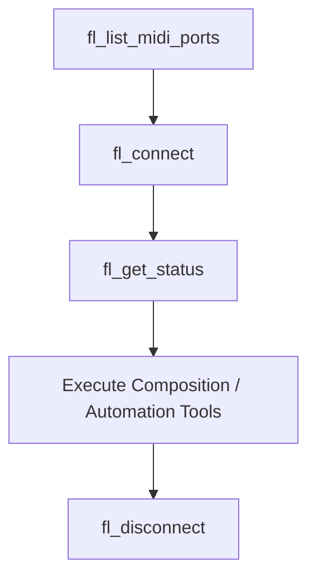

# FL Studio MCP Skill

This skill guides AI agents on how to dynamically control FL Studio, generate complex algorithmic compositions, manage VST presets via coordinate clicks, and route channels cleanly using the **FL Studio MCP Server**.

---

## 🛠️ Core Tool Workflow

Always follow this precise sequence to establish a healthy connection session:

1. **Scan Ports**: Run `fl_list_midi_ports` to find available hardware and virtual MIDI devices.
2. **Connect**: Run `fl_connect` with the target loopback port (e.g. `"FL Studio Bus"` or `"loopMIDI Port"`). 
   * *Tip*: Pass `dry_run=true` during development to preview MIDI SysEx bytes without physical output.
3. **Verify Connection**: Call `fl_get_status` to ensure FL Studio's controller script is active and responding.
4. **Disconnect**: Always call `fl_disconnect` at the end of a session to free up system MIDI ports.

---

## 🎼 Algorithmic Composition Strategies

Use these tools to inject musical structures directly into the active piano roll pattern:

### 1. Euclidean Drums (`fl_insert_euclidean_drums`)
Distributes $k$ beats across $n$ steps as evenly as possible using Bjorklund's algorithm.
* **Use Case**: Rhythmic skeletons, high-hat grooves, and polyrhythms.
* **Mapping Syntax**: Pass a JSON string mapping channel index to note/rhythm parameters.
  * *Simple*: `'{"0": "C3", "1": 38}'`
  * *Advanced*: `'{"0": {"pitch": "C3", "hits": 5, "steps": 16, "rotation": 1}}'`

### 2. Markov Chain Melodies (`fl_generate_markov_melody`)
Generates organic, scale-constrained single-voice melodic lines utilizing transition matrices.
* **Constraint**: Note choices are strictly locked to the scale signature to prevent sour notes.
* **Velocity Curve**: Pass `"crescendo"`, `"decrescendo"`, or `"humanize"` to add expressiveness.

### 3. Voice-Leading Chords (`fl_insert_voice_led_progression`)
Parses string-based chord progressions and transposes notes to minimize overall voice jumps.
* **Syntax**: E.g. `"C5-major, G5-major, A4-minor, F4-major"`
* **Algorithm**: Performs optimal octave shifting so standard chord changes feel natural, smooth, and professional.

---

## 🎛️ Channel Routing & Mixing

* **Route Instrument to Mixer**: Call `fl_route_to_mixer(channel_index, track_index)` to route a rack instrument to a dedicated mixer insert.
* **Set Levels**: Adjust panning (`fl_set_mixer_pan`) or volume (`fl_set_mixer_volume`). 
  * *Formula*: A fader volume of `100` maps exactly to FL Studio's `0.787` unity gain.

---

## 🖱️ Deep VST & GUI Automation

When controlling third-party plugins (e.g., Serum, Vital) that do not expose MIDI preset changes:

1. **Catalog Preset**: Call `fl_catalog_vst_preset` saving the exact $X, Y$ coordinate coordinates of the plugin's patch forward button.
2. **Load Preset**: Call `fl_load_vst_preset` to automatically focus FL Studio and trigger a simulated mouse click on the coordinates.
3. **Rearrange Workspace**: Use `fl_reset_ui` to realign overlapping tool windows (`Ctrl+Shift+H`).

---

## ⚠️ Troubleshooting & Stick Note Recovery

* **Stuck Notes?** If a synthesizer hangs or rings indefinitely, immediately run **`fl_panic`** to broadcast a full MIDI All-Notes-Off signal across all tracks.
* **Write Acknowledgements**: If sending fast, successive notes, enable `RESP_ACK` in parameters to ensure FL Studio processes each note before sending the next.
